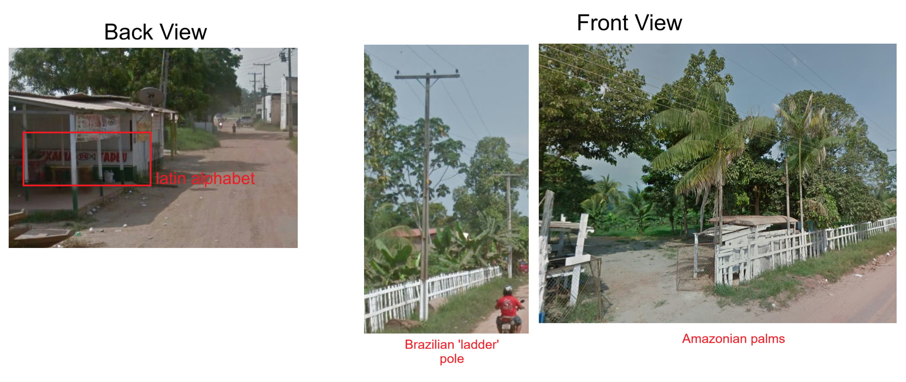
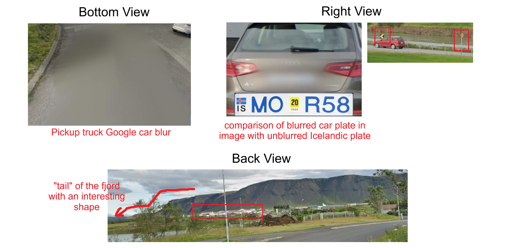
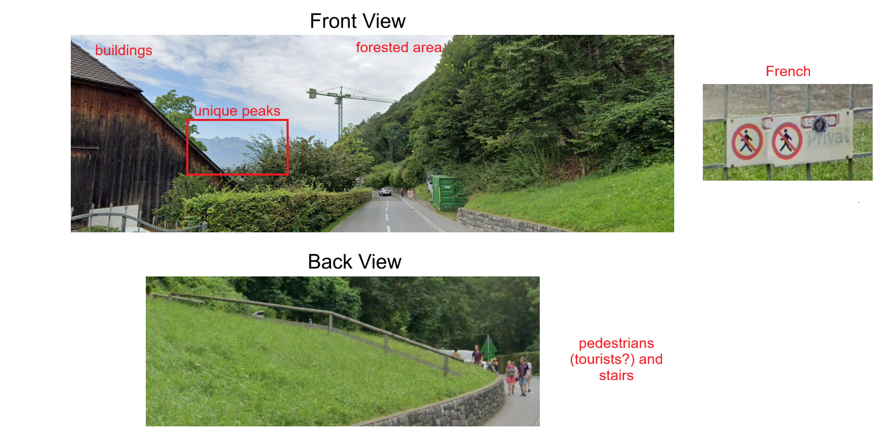
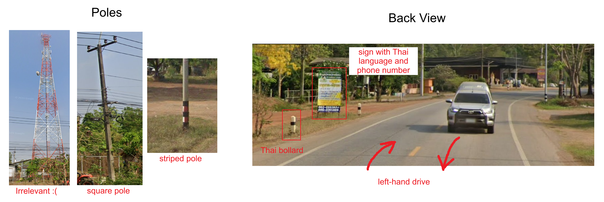

# Gissaplatser

This challenge involved pinpointing the precise location of 10 Google street view panoramas. Although you only needed 9 to get the flag, I found all 10, and will be including all of them in this writeup. 

All image files were panoramas, but for the sake of this writeup, if I'm referencing a part of the image, I will put together screenshots of the relevant parts of the image. 

### 1. michael
1. Reverse image search the snowy peaks in the background - **Grand Teton**
2. By comparing views of Grand Teton on street view with our image, we know we are on a road **south** of the mountains, moving **north** towards it, likely around the town of **Jackson, Wyoming**
3. Only search roads that are **paved** with a **double-yellow center line**

**Location: [43.4834487,-110.7934719](https://maps.app.goo.gl/o6r7wzEvj2VcRZJ97)**

_Funnily enough, I only noticed while writing this that the title of the location is supposed to be a hint... Michael Jackson..._

### 2. taeglichfrisch
1. Reverse image search the unique yellow building - it's the House of Clothes in Susuman, Russia

**Location: [62.7813144,148.1528901](https://maps.app.goo.gl/owTweJ6E2XEcSKcN7)**

### 3. phishing
1. Reverse image search the lake - it's Yunoko Lake in Tochigi, Japan

**Location: [36.7971619,139.429062](https://maps.app.goo.gl/jjaMrhevB4YDZ6cV8)**

### 4. bezos



1. Brazil  
The limited amount of text are all in **latin alphabet**, so it's unlikely Thailand/Cambodia. We can also see a **utility pole with ladder-style indents and a white painted base**, which is typical for Brazil (though the normal Brazilian pole is much thicker than this). The image features many palms (e.g. Acai palm) that are common in the **Amazon rainforest**.

3. Amazon...?  
As the image features a river, I started my search along small towns lining the Amazon river, across several states.

4. Amazonas!!
I realised that the title of this image (bezos -> Jeff Bezos -> Amazon) could mean the Brazilian state of **Amazonas**, not the entire Amazon rainforest as a whole. I finally found it in the town of Iranduba, just south of Manaus.

**Location: [-3.2920818,-60.1881909](https://maps.app.goo.gl/XS8m3QYNiza23tNT9)**

### 5. selbstlos



1. **Pickup truck** Google car blur + white license plate with **blue text and yellow mark** in the middle + **yellow-on-black chevrons** + **yellow speed limit sign** --> Iceland
2. Reverse image search the fjord with the prompt "where in Iceland". A lot of fjords in Iceland look similar (at least, in my opinion) so when parsing through search results, look out for (1) **white houses with red roofs** at the base and (2) the **extended "tail"** of the fjord.
3. We are in Selfoss.

**Location: [63.940271,-21.0039379](https://maps.app.goo.gl/EowJbRymB8jby1Z79)**

_Once again, I'm only now noticing the title of this image is selbstlos, German for 'selfless', which of course, sounds a whole lot like Selfoss..._

### 6. tip
1. Lucky for us, the street sign is legible! It says "St. Francis Weg". '**Weg**' is 'road' in Afrikaans (and Dutch and German), suggesting we will be in South Africa, as opposed to Australia
2. Search 'St. Francis Weg South Africa' on Google Maps turns up a rather long road in Cape St. Francis. As the image suggests, we will be at its very tail end, near the lighthouse.

**Location: [-34.2085457,24.8360782](https://maps.app.goo.gl/wE2XL26WvsNFdp946)**

### 7. wheniwanttogetdrunkigoto

1. Malta
EU license plate, Maltese architecture. Malta is very dense and well-covered by Google street view, though. So how do we find this place?

2. Statue
There's a blurry **statue** in the background. I then went on Open Street Map and realised monuments in Malta are quite thoroughly mapped on there. So much so that the broadest query turned up over 1000 pieces of public art.

3. Query 
Using Overpass Turbo, I queried for all statues in Malta. There were about 40 results, much more manageable than 1000. Lucky for me, the statue in question was mapped out - the Agatha Barbara statue, in Zabbar.
```
{{geocodeArea:Malta}}->.searchArea;

nwr['historic'='memorial']['memorial'='statue'](area.searchArea);

out geom;
```


**Location: [35.8768694,14.5400212](https://maps.app.goo.gl/VAW9NaHtXT7fGN7C7)**

_Yet again, only now noticing that the title of this image is a clue - when i want to get drunk i go to... the bar <=> zabbar. I hate it here._

### 8. royal


1. French on the sign + very tall mountain + title of this image --> Liechtenstein, a **French-speaking monarchy in the Alps**
2. Reverse image search the mountain with the prompt "where in Liechtenstein". Matching the unique shape of the peaks with our [search results](https://globalcitizen.world/hidden-gems-of-european-microstates-a-comprehensive-guide/) puts us in and around the town of **Vaduz**
3. In the image, we have building(s) to our left and a forested area to our right. The abundance of pedestrians and presence of infrastructure that facilitate hiking (stairs, railings) suggest we are near a hiking area. I searched for hiking spots in Vaduz and quickly found it.

**Location: [47.1393063,9.5257536](https://maps.app.goo.gl/NveZEndqn3AdKrb2A)**

### 9. hq
1. The sign for the train says 'Einbahnstrasse' (as opposed to 'Einbahn' in Austria) --> Germany
2. Reverse image search the unique building. It is the [Research & Development INFAI GmbH](https://www.infai.co.uk/contact/) in Bochum, Germany

**Location:[51.4439813,7.2549535](https://maps.app.goo.gl/Wxs2rvMXMBNi22aa7)**

### 10. radio
_This was the last image I solved, and it took much longer than it should have. Unlike #4, where I failed to see the connection between the hint in the image title and its location, here I hyperfixated on a connection that wasn't there._



1. Thailand
Yellow-and-black striped pole base, square concrete utility poles, black-and-white striped bollard, left-hand drive, Thai language

2. Red(io) Herring
There is a massive **red-and-white lattice radio tower** in the image. As this image was titled 'radio', I falsely believed this was the intended solution pathway. Using Overpass Turbo, I queried for all radio towers, then all lattice towers in Thailand. All in all, I spent 2 hours looking at almost 200 locations and eventually gave up.

3. The Morning After
The next day, with fresh eyes, I finally clocked the **phone number** in the image. I'd ignored it the day before because the prefix was not useful for region-guessing in Thailand... forgetting that I could _just Google it_.

4. School
The number **082-2553624** is for โรงเรียนสายมิตรวังท่าช้าง (Sai Mitr Wang Tha Chang School) in Prachin Buri, Thailand. Searching along the main road (highway 2006) through neighboring towns, I found the radio tower in less than 5 minutes, in the town of Bo Thong.

**Location: [13.9160591,101.838961](https://maps.app.goo.gl/z5K7nSLQuZNSAKgP8)**


## Final Thoughts
Overall, most of the locations were not difficult. I found 8 images relatively quickly but got tripped up on #4 and #10, which cost me hours. It's unfortunate that the radio tower in #10 was not mapped on OSM. I did expect that Thailand was unlikely to be very thoroughly mapped and evidently, I should've trusted my gut and not overcommitted to that method without first exploring easier alternatives. Massive blunder on my end.


It's amusing to me that the images that require a bit of elbow grease to find (i.e. more than just reverse image searching) had titles that were intended to function as clues. With the exception of #4 and #8, I genuinely did not notice that pattern at all before writing this writeup. It's rather annoying to consider how you had to write a whole query and look at 40+ statues in Malta when someone else could've solved it by just looking at the map of Malta and going 'wheniwanttogetdrunkigoto... zabbar? hahaha'. Sigh.
