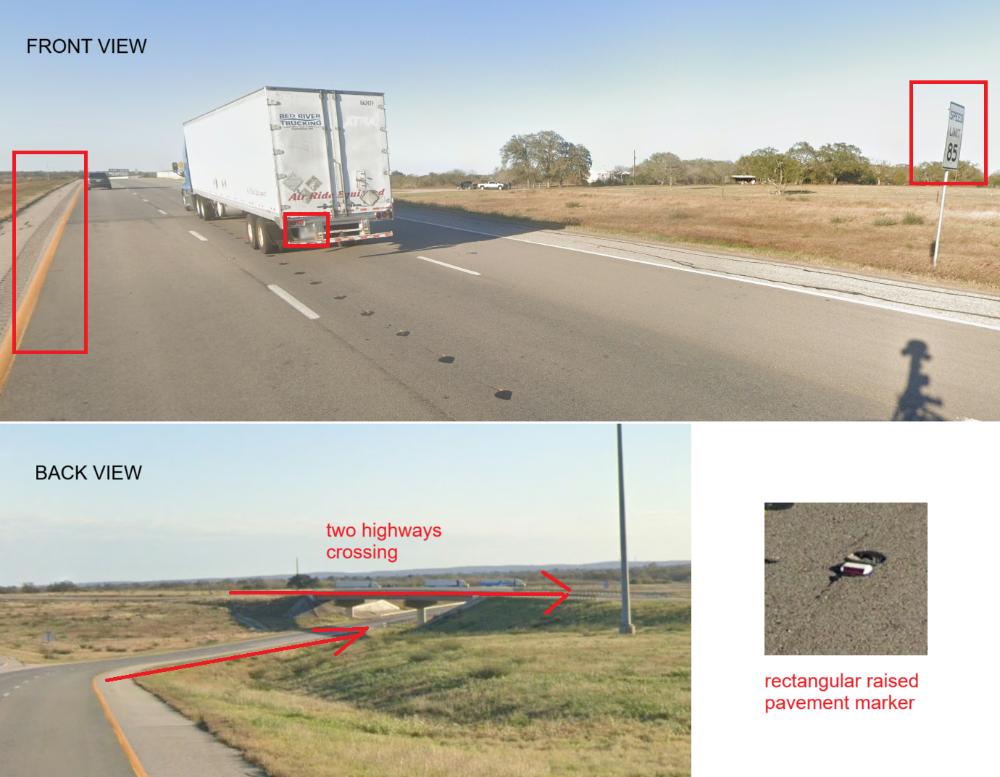

# Z - Easy

I was the 6th solve out of 23, and it took me about 4.5hours. Not a bad effort for a solo attempt, especially as I only started 5hours after the challenge was released.

All image files were panoramas, but for the sake of this writeup, if I have to reference any part of the image, I will put together screenshots of the relevant parts of the image. We only needed to solve 9/10 of the images to pass the challenge, but I will include my solution for the 10th.


### 1. Taxi
1. Taxi with "Vulcano Taxi Santi" - we are on the island of Vulcano in Italy
2. We are on the side of a mountain - search roads with high elevation using Google Maps' terrain setting.

**Location: [38.3768717,14.987448](https://maps.app.goo.gl/Bj5jHE6Qgvezarxw8)**

### 2. Bridge


1. Reverse image search the bridge. You may get multiple results (I did) so check that it has a Y-shaped intersection at its mouth - this is the Governador Nobre de Carvalho Bridge in Macau.
2. Road is elevated and almost directly perpendicular to the bridge.
3. On the map, there is only one road that fits. Confirm by matching the thick white guardrails and tall white building up ahead.

**Location: [22.1635853,113.5495017](https://maps.app.goo.gl/uLkVma2bwZ62drhS9)**

### 3. Site


1. Red-and-white chevrons and white bollard with a red stripe - this is Turkey
2. Reverse image search the landscape, with the input "Site in Turkey" - this is near Pamukkale, Denizli
3. Confirm the area using street view, by matching the tall mountain ridge and shorter, yellow ridge in front.
4. Search on paved roads only.

**Location: [37.9247485,29.1159054](https://maps.app.goo.gl/G5JaRi68bgoVDZ259)**

### 4. Sanic


1. Rumble strips, short white license plates, rectangular raised pavement markers - Southwest USA
2. 85mph speed limit is only found in [Texas, right outside Austin](https://images.squarespace-cdn.com/content/v1/60f6054f4e76b03092956de8/2778cce7-914f-4f86-9dbf-81d4f16271ec/2us_speed_limits.png?format=2500w). Specifically, Wikipedia listed [highway 130, between SH45 and Interstate 10](https://en.wikipedia.org/wiki/Texas_State_Highway_130).
3. Search along the 130, focusing on areas where another highway crosses over the 130 perpendicularly.

**Location: [29.6160679,-97.876556](https://maps.app.goo.gl/38WsDmNZCarg5ffi7)**

### 5. Bus_stop
_I knew this was Poland from its unique pedestrian crossing sign. I then considered trying overpass turbo, but moved on. 
I did solve it retroactively. Searching the [text on the bin](https://skipgroup.pl/) helps narrow down the search region to Poznań. From there, write overpass turbo query and check each result (there are 8):_
```
// define search area as Poznań
area["name"="Poznań"]["admin_level"="8"]->.searchArea;

// find all buildings in Poznań with house number 51
nwr["building"]["addr:housenumber"="51"](area.searchArea)->.resbuilding;

// find all churches in Poznań
(
  nwr["amenity"="place_of_worship"](area.searchArea);
  nwr["building"="religious"](area.searchArea);
)->.reschurch;

// find all bus stops around the buildings
node(around.resbuilding:100.00)["bus"="yes"](area.searchArea)->.resbus;
// filter bus stops to those near churches too
node.resbus(around.reschurch:100.00)->.result;

// outputs relevant bus stops
.result out body;
```
_I am intentionally vague/generous with the query. I included as few filters as possible and cast a wide net for how churches/houses are defined. This is because OpenStreetMap is often inconsistent with the amount of labels it stores for any location, which is also the reason why I didn't want to try using overpass when I was solving this challenge initially._

**Location: [52.3667668,16.9446273](https://maps.app.goo.gl/7vDuk6dRxmzvKMXw6)**

### 6. No_Entry
_I must confess this challenge had a large acceptable radius for each guess, so I bruteforced the answer and only found the precise location retroactively._
1. Text on the wall "ANGNUAM RAM CHHUNG HI ISUA TAN KAN HAWH TLAT AN" is written in the Mizo language - Mizoram, India
2. 'Angnuam' has been cut off, it actually refers to 'Tlangnuam' in Aizawl, Mizoram.

**Location: [23.7056862,92.7155214](https://maps.app.goo.gl/LiKRZ4ZdHfnWCQoN7)**

### 7. Parking


1. GERMAN BOLLARDS
2. Reverse image search suggests we are in the island of Sylt in Schleswig-Holstein.
3. Google Maps search 'nearby Parking' in Sylt and check roads next to parking lots.

**Location: [54.8105708,8.2888259](https://maps.app.goo.gl/wPGSaHzge15XWoic9)**

### 8. Tour_Bus


1. Black Google car long antenna - Russia
2. Using the [Russia Plonkit guide](https://www.plonkit.net/russia#3) to match the landscape (gravel soil and snowy mountains) - Kamchatka Peninsula
3. There is a singular road stretching up the peninsula. Check sections with unpaved road and sparse tree cover, such that mountains are visible on either side.

**Location: [53.9496019,157.7387358](https://maps.app.goo.gl/beUUXBDEVVdYtVE58)**

### 9. Dragon
1. Reverse image search the little dragon pagoda - Penghu County
2. Reverse image search the building with the prompt "where in Penghu County" - Twin Hearts Stone Weir rest stop 

**Location: [23.2187982,119.4464139](https://maps.app.goo.gl/1y9pgMgh3jWvNnwp8)**

### 10. 2011


1. Houses look quite nordic/baltic. Though I didn't recognise the meta offhand, I knew unique coverage like this (visual glitch), would be noted by the Geoguessr community, so I searched through resources for all the baltic and nordic countries.
2. Using [Plonkit's Sweden guide](https://www.plonkit.net/sweden-2#3), a similar purple visual glitch was observed in coverage of the island of Holmön.
3. Search the few roads in Holmön, looking out for the big white house (most houses are red/brown).

**Location:[63.7867334,20.8744968](63.7867334,20.8744968)**
