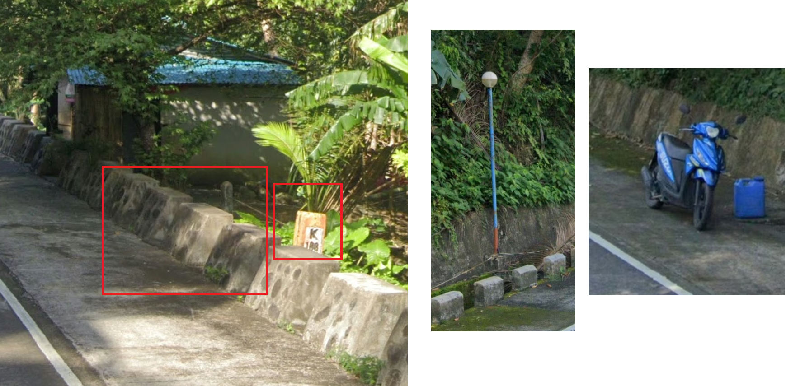

# Z - Hard

I was the 5th solve out of 9, and it took me about 7hours. My time could've been cut in half if I didn't (1) hyperfixate on a problem (i.e. cabbage) without a proper plan (2) forget that kilometer markers measure distance in terms of physical road length not as the crow flies (yes this is foreshadowing).

All image files were panoramas, but for the sake of this writeup, if I have to reference any part of the image, I will put together screenshots of the relevant parts of the image. We only needed to solve 9/10 of the images to pass the challenge, but I will include my solution for the 10th.

### 1. Torga
1. Reverse image search the ruins - it is the Castelo de Miranda Do Douro in Portugal

**Location: [41.4969674,-6.2753894](https://maps.app.goo.gl/2inbMj4uEfsoy9yK8)**

### 2. Mini_cooper
1. Reverse image search the bay in the distance - it is Penguin, Tasmania, Australia
2. We are in a residential area, at the end of a cul-de-sac. Search all dead ends in residential areas in Penguin.

**Location: [-41.1111428,146.0649474](https://maps.app.goo.gl/saqjrJ9MVP5a35FC8)**

### 3. Vagrant
_Oh goodness... this took me literal hours. It might be the third challenge on the docket but it was the last one I finished._

1. Washington State:
 The rare variant of the [Washington State bollard](https://www.plonkit.net/united-states-2#1) (white instead of the usual brown). Reverse image search narrowed things down to Puget Sound.

2. Bainbridge Island(?):
Reverse image search, focusing on the two houses, pulled up several listings on Bainbridge Island. Using satellite view, I looked along the coast for a house with a visible tennis court. I found nothing.

_I then gave up. I came back several hours later..._

3. Coverage:
The Google copyright on the panorama suggested the coverage occurred in 2024. The footage was also taken on a virtually cloudless day. I finally notice that the coverage on Bainbridge Island (taken in 2013, 2018 or 2024) is noticeably cloudier. I was looking at the wrong island.

4. The Butterfly Method:
 (This is the method that miraculously found me 'butterfly' in idekCTF 2024.) I [generated 100 random locations in Puget Sound that had 2024 coverage](https://map-degen.vercel.app/) and observed the distribution. 2024 coverage was everywhere, but a similar-looking island caught my eye.

 5. Fox Island:
 I immediately noticed the matching cloudless coverage, and used satellite view to scan along the coast.

**Location: [47.2397457,-122.6311317](https://maps.app.goo.gl/4qw1y2hVC3faLxFM6)**

_**NOTE:** I was avoiding relying on the Google copyright date, because I'd noticed in some of the previous locations the copyright date didn't match the actual coverage date. I just got lucky it worked._

### 4. Walkable

1. The Argentina/Alaska 50-50:
I thought it was max south Argentina, because the car behind us seemed to have an Argentina license plate. However, reverse image search insisted it was Valdez, Alaska. AI wins again, as roads in Tierra del Fuego have no rumble strips or yellow centre line, while the Alaskan roads do.
2. Distinct mountain range and lake to the left
3. Pedestrian pathway with a woman walking suggests we are near a town
4. Check roads leading in and out of Valdez near the water, looking out for a matching mountain range.

**Location: [61.1380127,-146.3191159](https://maps.app.goo.gl/fKERdtPmEvXccWBs9)**

### 5. 1f5ff
1. Reverse image search the airport building - it is Aeropuerto Internacional Chacalluta in Arica, Chile

**Location: [-18.3501287,-70.3356245](https://maps.app.goo.gl/8aFqsjBwtX7Jv2Qx5)**

### 6. Shipping

1. Square utility pole with holes - Thailand
2. Reverse image search on the island in the distance suggests this image is a view from Ko Sichang. Using streetview on Ko Sichang, confirm that the island we're looking at is Ko Kham Yai.
3. We are on a hill
4. Using Google Maps' terrain feature, search areas of high elevation on Ko Sichang that face Ko Kham Yai.

**Location: [13.1514795,100.8066122](13.1514795,100.8066122)**

### 7. Blue

1. Another Argentina/Alaska 50-50?
Google Lens suggests its BC/Alaska again, but I know better this time. Double yellow center road lines exist in all 3 countries, but this is clearly the black Argentina Google car. Prompting Google Lens with 'where in Tierra del Fuego is this' returns somewhere around Lake Yehuin or Fagnano.
2. To confirm, randomly test a few locations around the lakes on street view. We _are_ in the right area, as coverage around the lakes also features:
    - A vertical camera rift on the right
    - Paved roads with unpaved road shoulders
3. We are right next to a body of water (lake) and driving towards a distinctive set of mountains with no snow on them.
4. Search the roads along the lakes, looking out for the mountains.

**Location: [-54.5366676,-67.2075348](https://maps.app.goo.gl/Es6UvhWXe1VrrdnA8)**

### 8. Crop_circles
_Probably my flukiest solve out of all_

1. [Short, thick car antenna leaning to the left](https://www.plonkit.net/namibia) - Namibia
2. Google car is [fully blurred out](https://images.squarespace-cdn.com/content/v1/60f6054f4e76b03092956de8/a9a87dee-30b0-4aa8-b09c-0667e1e5c75e/12A.png?format=1500w) and the road is [unpaved](https://images.squarespace-cdn.com/content/v1/60f6054f4e76b03092956de8/8116f27e-e85e-4d34-9421-d492b5662243/11.png?format=1500w). We are likely on a sideroad of the B1 or in a town. I did briefly look through several options, but decided to try another approach.
3. There are date palms in the background, which aren't native to Namibia. The neat rows of vegetation and crop circles suggest we are in a farm. Googling 'date palm plantation Namibia' produced [this result](https://digital-media.fao.org/archive/Namibia--Date-palm-farm-2A6XC56ZTV3.html) describing a program that introduced date palms to farmers in 'Hardap Settlement'.
4. Looking at streetview in the town of Hardap and the neighboring Mariental, I observed a similarly flat landscape with slightly red soil. 
5. I searched several roads, looking out for a similar fence and date palms.

**Location: [-24.6133211,17.9340563](https://maps.app.goo.gl/MV8MqAFfsxT3v5bx5)**

### 9. Cabbage
_I searched the text on the church but as it turns out there's a million and one 'Suhyang Church' in Korea. I reverse image searched the church, which returned a [blog post from Bongilcheon church's youth camp](http://www.xn--439atxg5ymldf4q6oh5ws.com/bbs/board.php?bo_table=board3_4&wr_id=18), with no details on its location. I spent hours OSINT-ing them - looking through their past calendar events, their Facebook, etc, for a mention of where this camp was held but no cigar._

_I have retroactively solved it now. On the aforementioned blog post, there is a [picture of a truck](http://www.봉일천감리교회.com/data/file/board3_4/thumb-978009846_9bmoB1vz_KakaoTalk_20150815_204120881_890x1582.jpg) with a [Gangwon province license plate](https://en.wikipedia.org/wiki/Vehicle_registration_plates_of_South_Korea).  Search '수향교회 in Gangwon-do' on Google Maps. Note that Suhyang Church **must** be written in Korean/Hangeul script._

**Location: [37.5574945,128.5650274](https://maps.app.goo.gl/QnpvhRY3vvbuRoVt5)**

### 10. Blocks
_Yet another location that took me hours!_

1. Tall yellow kilometer markers, motorcycle without a front license plate - Philippines, not Indonesia
2. [Trapezoid-shaped blocks with pebbles](https://rmrg.me/philippines/) - East Calabarzon
3. Philippines kilometer markers measure the [distance from the KM 0 marker in Luneta, Manila](https://www.facebook.com/photo.php?fbid=892610812894642&id=100064371931233&set=a.194289766060087) - we are 188km away from Luneta.

_I assumed it was 188km as the crow flies (a false assumption I've made before, and clearly haven't learned from). An hour of fruitless searching later, I realised 188km refers to the total physical length of the road._ 

4. Use Google Maps to identify points on roads in East Calabarzon that have an approximate driving distance of 188km to Luneta, then scan about 1-2km up and down the roads from those points.
5. While scanning in the town of San Rafael, I notice lamps of a similar design and know I'm near.

**Location: [13.9097061,121.9948618](https://maps.app.goo.gl/mbwZSCE7FWoi9UhQ8)**
